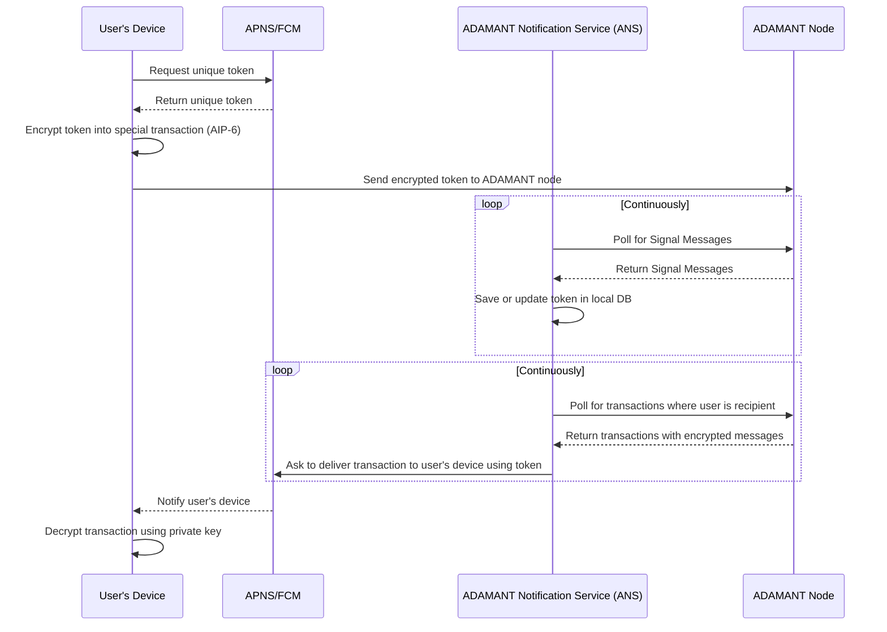

# ADAMANT Notification Service (ANS)

## How it works

To deliver notifcations privately and secure, 4 parties are involved:

1. User's device (Android or iOS)
2. ADAMANT node
3. Apple Push Notification Service (APNS), for iOS, or Firebase Cloud Messaging (FCM), for Android
4. This application, ADAMANT Notification Service (ANS)

A workflow runs as:

- User's device requests a unique token from APNS or FCM
- User encrypts that token into a special transaction type ([AIP-6: Signal Messages](https://aips.adamant.im/AIPS/aip-6)) and sends it to an ADAMANT blockchain node
- Meanwhile, the ANS polls the ADAMANT node continuously to find Signal Messages. After it saves the token (alongside the ADM address) or updates the old one into a local DB
- ANS polls the ADAMANT node and filters transactions where the user is the recipient. ANS asks APNS/FCM to deliver these transactions to the user's device
- APNS or FCM notifies the user's device
- The user's device receives a notification and decrypts the transaction using a private key

