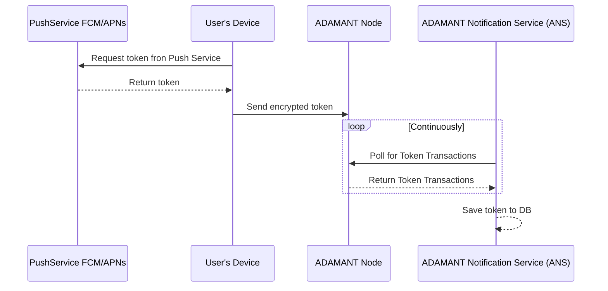
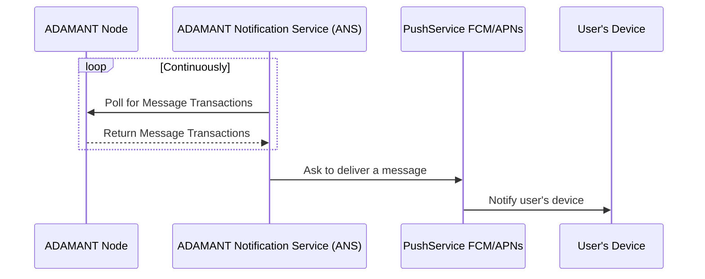
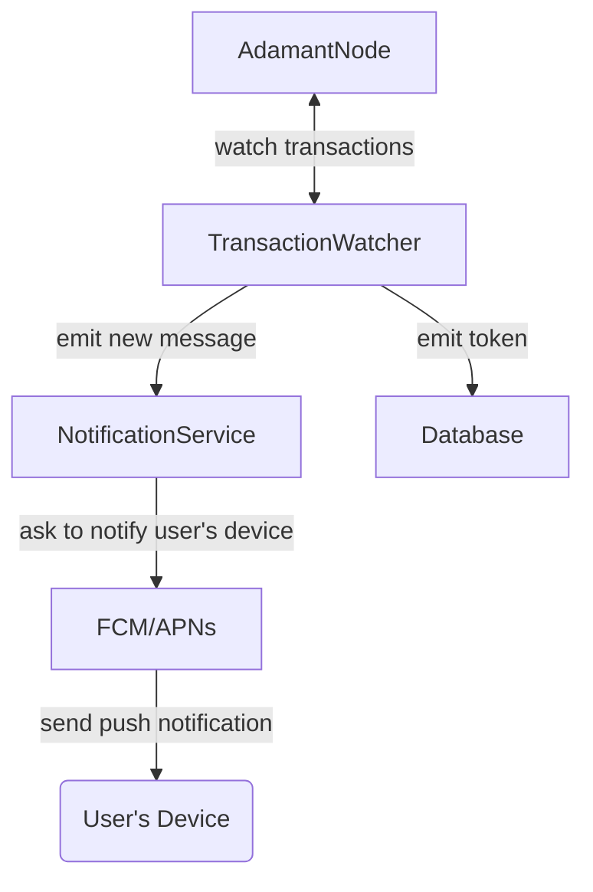
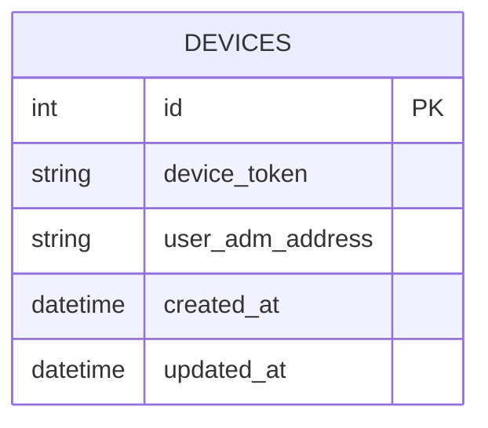

## Send a token flow

## New message flow

## ANS

## Database

## Stack

- TypeScript with ESM configuration (`type: "module"`)
- `prisma`: Postgres as a database
- `adamant-api`, for interacting with blockchain
- `firebase-admin` for sending Push Notifications via FCM
- `pino` for logging
- `json5` for configuration files
